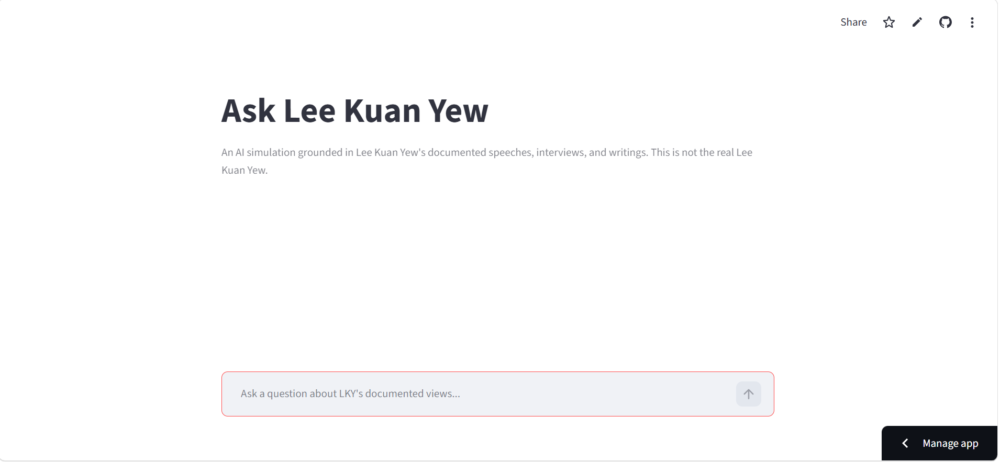
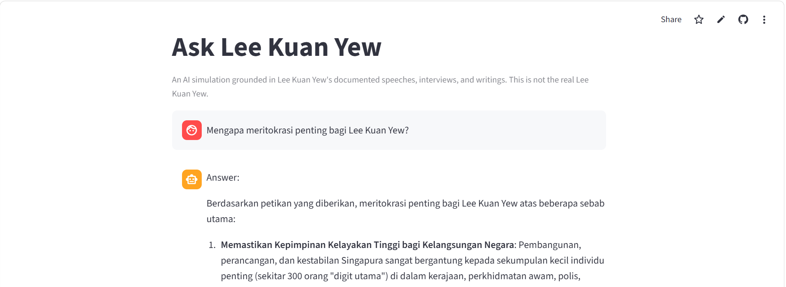
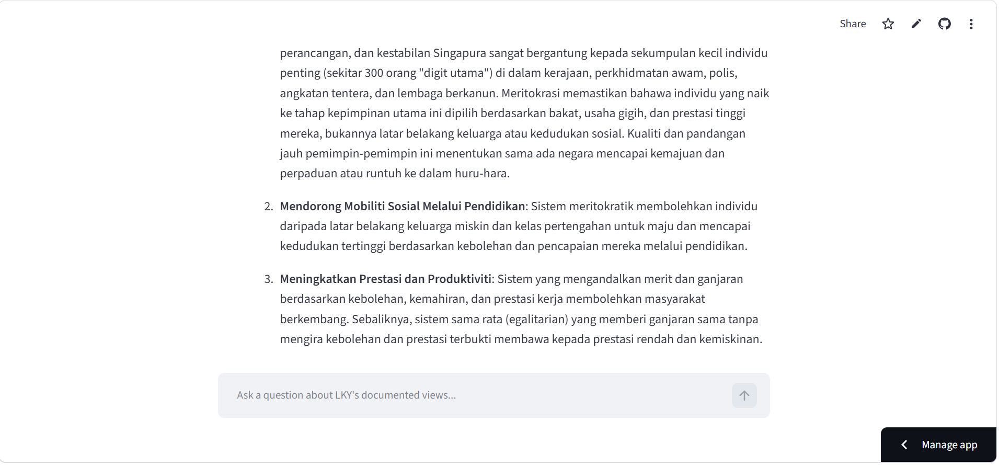
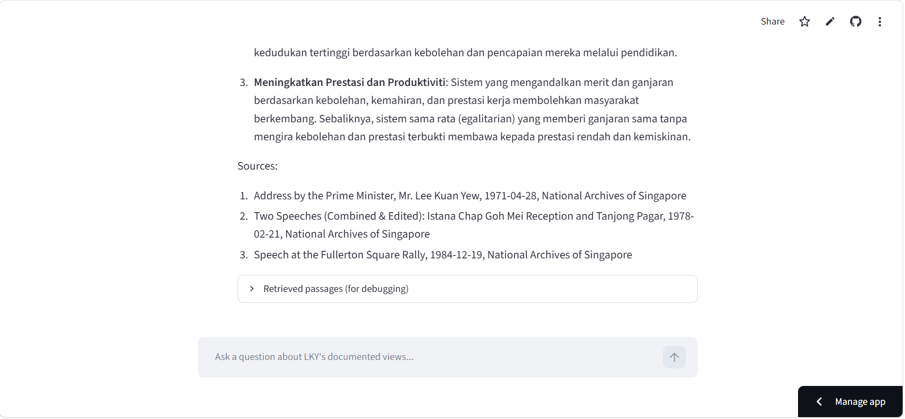

<div class="hero">

<h1>🇸🇬 Ask Lee Kuan Yew — Grounded RAG Chatbot</h1>

<p>Evidence-Grounded AI Simulation · Retrieval-Augmented Generation · Hallucination Control · Evaluation-Driven Engineering</p>

<p>
  
  
  
  
  
  
  
  
</p>

<p>
A retrieval-augmented chatbot designed to answer questions from Lee Kuan Yew's
documented speeches and public archival records — with retrieval, citations,
explicit abstention, and evaluation treated as core system requirements.
</p>

</div>

---

> **⚠️ Disclaimer**
>
> This project is an **AI simulation grounded in documented speeches, interviews, and public archival records associated with Lee Kuan Yew**. It is **not Lee Kuan Yew**, does not represent his actual person or views, and does not claim to reproduce his identity.
>
> The system is designed to answer only when the retrieved source material provides sufficient evidence. When the available evidence does not establish a clear position, the system is instructed to abstain rather than invent an answer or quotation.

---

## 📖 Project Overview

**Ask Lee Kuan Yew** is a retrieval-augmented generation (**RAG**) application built around one engineering constraint:

> **No evidence, no claim.**

The project was developed for a **"What Would Lee Kuan Yew Do?" AI application challenge**, where the objective was not simply to create a chatbot that *sounds* convincing, but to engineer a system whose answers can be traced back to documented source material.

The architecture is intentionally split into two decoupled pipelines:

```text
OFFLINE — DOCUMENT INDEXING
Primary source documents
        ↓
PDF download & extraction
        ↓
Text cleaning
        ↓
Abbreviation-aware sentence chunking
        ↓
Overlapping context windows
        ↓
gemini-embedding-001
(RETRIEVAL_DOCUMENT)
        ↓
ChromaDB vector store


ONLINE — USER QUERY
User question
        ↓
Query embedding
        ↓
gemini-embedding-001
(RETRIEVAL_QUERY)
        ↓
Top-k semantic retrieval
        ↓
Gemini 2.5 Flash
        ↓
Grounded answer generation
        ↓
Answer + source citations
```

The separation keeps document indexing independent from interactive querying, avoiding unnecessary re-processing of the corpus for every user question.

---

## 🎯 Project Objectives

The system was designed around six primary objectives:

1. **Ground answers in documented evidence** rather than relying solely on model memory.
2. **Attach source citations to generated responses** using retrieval metadata.
3. **Abstain explicitly** when the retrieved evidence does not support a reliable answer.
4. **Prevent fabricated quotations and unsupported attribution.**
5. **Respect source-data usage constraints** by keeping primary document content out of the public repository.
6. **Evaluate the system systematically** with a benchmark instead of relying only on qualitative demo impressions.

---

## ✨ Key Features

### 🔍 Evidence-Grounded Retrieval

Every query passes through a semantic retrieval layer before generation.

The system uses Google's `gemini-embedding-001` with different task types for documents and queries:

```text
Document indexing → RETRIEVAL_DOCUMENT
User question     → RETRIEVAL_QUERY
```

The distinction is intentional: the indexing and querying stages are optimized for their respective retrieval roles rather than treating all embedding requests identically.

Retrieved passages are then passed to the generation layer as the evidence available for answering the user's question.

### 🚫 Hallucination & Abstention Control

The generation layer is constrained by a dedicated system prompt containing explicit grounding rules.

The model is instructed to:

* avoid inventing facts,
* avoid inventing quotations,
* avoid fabricating citations,
* avoid attributing unsupported opinions to Lee Kuan Yew,
* avoid answering beyond the available evidence,
* explicitly abstain when retrieved evidence is insufficient.

The required abstention behavior uses the phrase:

> *"The available sources do not establish a clear position on this topic."*

This is particularly important for questions involving topics, technologies, or events outside the historical scope of the available source material.

### 📚 Source-Grounded Citations

Citations are not generated freely by the model.

The application constructs the `Sources` section from metadata attached to the retrieved passages, such as:

* source title,
* publication date,
* publication information,
* original source URL.

This creates a clear separation between:

```text
LLM-generated answer
        +
Application-generated source metadata
```

The result is easier to inspect and significantly reduces the risk of a plausible-looking but fabricated reference.

### ⚖️ Copyright-Aware Data Governance

The architecture was designed around the usage constraints of the **National Archives of Singapore** source material.

The public repository stores:

* source metadata,
* provenance,
* titles,
* dates,
* original URLs,

but does **not** commit the source PDFs, extracted text, or pre-built vector database.

At runtime, the application can retrieve the primary documents and rebuild the index rather than redistributing a packaged copy of the source corpus.

See [Data Governance & Legal Compliance](#-data-governance--legal-compliance).

### 🧪 Evaluation-Driven Development

The project includes a **24-question evaluation benchmark** covering both ordinary and adversarial use cases.

The benchmark includes questions across:

* leadership,
* geopolitics,
* governance,
* meritocracy,
* Singapore–Malaysia relations,
* China,
* education,
* social policy,
* temporally out-of-scope topics,

along with adversarial cases designed to test:

* leading premises,
* fabricated quote requests,
* unsupported assumptions,
* temporal boundary violations,
* multi-topic reasoning.

Evaluation is divided into:

```text
Automatic
├── Citation correctness
└── Abstention accuracy

Manual / Rubric
├── Retrieval relevance
├── Groundedness
└── Answer relevance
```

### 💬 Transparent Streamlit Interface

The Streamlit interface exposes not only the generated response but also the evidence used to produce it.

An expandable retrieval/debug view allows the developer to inspect:

* retrieved passages,
* source metadata,
* similarity distances,
* retrieval quality for individual questions.

This turns the interface into both a user-facing application and an engineering diagnostic tool.

---

## 🏗️ System Architecture

```text
                    ┌──────────────────────────┐
                    │     PRIMARY SOURCES      │
                    │ National Archives / etc. │
                    └────────────┬─────────────┘
                                 │
                                 ▼
                    ┌──────────────────────────┐
                    │      PDF INGESTION        │
                    │ download → extract → clean│
                    └────────────┬─────────────┘
                                 │
                                 ▼
                    ┌──────────────────────────┐
                    │       CHUNKING            │
                    │ sentence-based + overlap  │
                    └────────────┬─────────────┘
                                 │
                                 ▼
                    ┌──────────────────────────┐
                    │       EMBEDDING            │
                    │   gemini-embedding-001   │
                    │ RETRIEVAL_DOCUMENT mode  │
                    └────────────┬─────────────┘
                                 │
                                 ▼
                    ┌──────────────────────────┐
                    │        CHROMADB            │
                    │    vector persistence     │
                    └────────────┬─────────────┘
                                 │
                                 │
              ┌──────────────────┴──────────────────┐
              │                                     │
              ▼                                     ▼
      ┌─────────────────┐                  ┌─────────────────┐
      │  USER QUESTION  │                  │ SOURCE METADATA │
      └────────┬────────┘                  └─────────────────┘
               │
               ▼
      ┌──────────────────────┐
      │ Query Embedding      │
      │ RETRIEVAL_QUERY      │
      └──────────┬───────────┘
                 │
                 ▼
      ┌──────────────────────┐
      │ Top-k Retrieval      │
      │ ChromaDB Similarity  │
      └──────────┬───────────┘
                 │
                 ▼
      ┌──────────────────────┐
      │ Gemini 2.5 Flash     │
      │ Grounded Generation  │
      └──────────┬───────────┘
                 │
                 ▼
        ┌───────────────────┐
        │ Answer + Sources  │
        └───────────────────┘
```

---

## 🧭 Design Principles

### 1. Groundedness Over Fluency

A shorter answer supported by evidence is preferable to a fluent answer containing unsupported claims.

### 2. Abstention Is a Feature

The system is intentionally allowed to say that the evidence is insufficient.

For this application, **knowing when not to answer** is part of system quality.

### 3. Citations Are Derived, Not Invented

Source references are constructed from retrieved metadata rather than asking the language model to create citations from memory.

### 4. Evaluation Before Optimization

Thresholds and retrieval strategies should be justified by actual benchmark behavior rather than arbitrary constants.

### 5. Legal Constraints Influence Architecture

The handling of copyrighted or restricted source material is treated as an architectural concern, not merely a documentation issue.

### 6. Engineering Decisions Should Be Reversible and Explainable

When testing disproves an initial design assumption, the implementation changes and the reason is documented rather than hidden.

---

## 🗂️ Technical Components

| Component                 | Technology                 | Responsibility                                 |
| ------------------------- | -------------------------- | ---------------------------------------------- |
| 📄 **Document Ingestion** | `pypdf`                    | Download and extract source PDF text           |
| ✂️ **Chunking**           | Custom Python pipeline     | Sentence-aware splitting with overlap          |
| 🧬 **Embeddings**         | `gemini-embedding-001`     | Semantic document/query representation         |
| 🗄️ **Vector Store**      | ChromaDB                   | Local vector persistence and similarity search |
| 🔎 **Retriever**          | ChromaDB similarity search | Select top-k evidence passages                 |
| ✍️ **Generator**          | Gemini 2.5 Flash           | Produce grounded answers                       |
| ✅ **Validation**          | Pydantic                   | Structured data validation                     |
| 💬 **Application UI**     | Streamlit                  | Interactive chat and retrieval inspection      |
| 🧪 **Evaluation**         | Python benchmark runner    | Automatic + rubric-based evaluation            |
| 🔐 **Configuration**      | `python-dotenv`            | Local environment configuration                |

---

## 🔬 Technical Implementation

### Sentence-Based Chunking

The original design considered paragraph-based chunking.

Testing against extracted parliamentary and speech PDFs showed that PDF extraction does **not consistently preserve paragraph boundaries**, making paragraph-based splitting unreliable.

The implementation was therefore revised to use:

* sentence-based chunking,
* approximately 250 words per chunk,
* 2-sentence overlap,
* abbreviation-aware sentence boundaries.

The abbreviation handling is important for material containing patterns such as:

```text
Mr.
Dr.
U.S.
U.K.
etc.
```

Without abbreviation awareness, a naïve sentence splitter can produce fragmented or semantically awkward chunks.

### Embedding Strategy

Documents and queries use task-specific embedding modes:

```text
Indexing:
gemini-embedding-001
RETRIEVAL_DOCUMENT

Querying:
gemini-embedding-001
RETRIEVAL_QUERY
```

The implementation uses the default **3072-dimensional embedding representation**.

Dimensionality reduction was deliberately avoided because the current corpus size does not justify the additional normalization and retrieval complexity.

### Retrieval

The default retrieval configuration uses **top-k = 5**.

The system currently does not rely on an arbitrary hard similarity threshold before generation.

Instead, the threshold decision is treated as an evaluation question:

```text
What threshold produces the best balance between
retrieval usefulness and incorrect confidence?
```

A numerical relevance threshold should therefore be introduced only after sufficient benchmark evidence exists.

### Generation

The generation layer uses:

```text
Model: Gemini 2.5 Flash
Temperature: 0.2
```

The lower temperature is intended to prioritize consistency and adherence to the grounding rules over creative variation.

Core constraints are stored in:

```text
prompts/system_prompt.txt
```

This keeps the grounding behavior explicit, reviewable, and version-controlled.

---

## ⚖️ Data Governance & Legal Compliance

This project treats data governance as part of system architecture.

The primary source material includes documents obtained from the **National Archives of Singapore**.

To avoid turning the public repository into a redistribution mechanism, the repository separates **provenance metadata** from **source content**.

### Public Repository

```text
data/sources.json
```

Contains information such as:

* document title,
* date,
* publication metadata,
* original source URL.

### Excluded From Repository

```text
data/raw/
data/processed/
data/chroma_db/
```

These directories contain or may contain derived source content and are intentionally excluded through `.gitignore`.

### Runtime Strategy

Instead of committing a pre-built vector index containing embedded representations of the source corpus, the application can reconstruct its local index from the original source URLs during deployment/runtime.

This creates an important engineering trade-off:

```text
Lower repository distribution risk
            ↓
More expensive startup / rebuild process
```

The decision prioritizes responsible source handling over convenience.

> **Important:** Source materials remain subject to the terms imposed by their respective rights holders. This repository's MIT license does not grant rights to third-party source documents.

---

## 🧪 Evaluation Framework

The evaluation suite contains **24 benchmark questions**.

The benchmark combines normal analytical questions with adversarial scenarios designed specifically to test whether the grounding constraints actually work.

### Benchmark Categories

| Category           | Purpose                                        |
| ------------------ | ---------------------------------------------- |
| Leadership         | Historical positions and leadership philosophy |
| Governance         | Government and institutional decision-making   |
| Meritocracy        | Education, talent and social mobility          |
| Geopolitics        | International relations and strategic thinking |
| Singapore–Malaysia | Bilateral and regional history                 |
| China              | Relations and geopolitical views               |
| Education          | Policy and human-capital questions             |
| Social Policy      | Society, development and public policy         |
| Adversarial        | Hallucination and grounding stress tests       |

### Adversarial Tests

The benchmark intentionally includes:

* leading or loaded premises,
* direct requests for fabricated quotations,
* questions about events outside the historical source scope,
* questions about posthumous technologies or developments,
* multi-topic prompts designed to expose unsupported inference.

### Evaluation Structure

```text
24 Questions
      │
      ▼
┌─────────────────────────┐
│ Retrieval + Generation  │
└───────────┬─────────────┘
            │
      ┌─────┴─────┐
      ▼           ▼
Automatic       Manual
Metrics         Rubric
      │           │
      ├─ Citation │
      │  correctness
      ├─ Abstention
      │  accuracy
      │           ├─ Retrieval relevance
      │           ├─ Groundedness
      │           └─ Answer relevance
      │
      ▼
Evaluation Report
```

No benchmark number is presented as a final performance claim until it has been produced by an actual evaluation run.

---

## 🧩 Key Engineering Decisions

Real engineering iteration is preserved here rather than presenting the project as though the final architecture existed from the beginning.

| Initial Assumption                                                    | Test Result                                                                      | Final Decision                                      |
| --------------------------------------------------------------------- | -------------------------------------------------------------------------------- | --------------------------------------------------- |
| Paragraph boundaries can be reliably detected from extracted PDF text | PDF extraction frequently breaks paragraph structure                             | Switched to sentence-based chunking                 |
| Simple sentence splitting is sufficient                               | Abbreviations can create false sentence boundaries                               | Added abbreviation-aware handling                   |
| `collection.add()` can be used safely for repeated indexing           | Duplicate IDs may be ignored instead of updated                                  | Switched to `collection.upsert()`                   |
| Pre-built vector storage is the simplest deployment strategy          | Vector data can effectively contain representations of protected source material | Rebuild index from original source URLs             |
| A fixed retrieval threshold can be chosen upfront                     | Threshold quality depends on real benchmark behavior                             | Delay threshold tuning until evaluation data exists |

This section is intentionally included because the project is as much about **engineering judgment** as it is about implementing a RAG pipeline.

---

## 🛠️ Technology Stack

| Layer                   | Technology             | Why It Matters                                |
| ----------------------- | ---------------------- | --------------------------------------------- |
| 🐍 **Core Language**    | Python 3.11+           | Main application and pipeline implementation  |
| 💬 **Application**      | Streamlit              | Fast interactive AI application layer         |
| 🧠 **Generation**       | Gemini 2.5 Flash       | Grounded natural-language response generation |
| 🧬 **Embeddings**       | `gemini-embedding-001` | Semantic retrieval representation             |
| 🗄️ **Vector Database** | ChromaDB               | Local vector persistence                      |
| 📄 **PDF Extraction**   | pypdf                  | Source document processing                    |
| ✅ **Validation**        | Pydantic               | Structured validation and data models         |
| 🔐 **Configuration**    | python-dotenv          | Environment-based configuration               |

---

## 📊 Project Status

This section is intentionally factual rather than promotional.

| Component                      | Status                 |
| ------------------------------ | ---------------------- |
| 📄 Source metadata pipeline    | ✅ Built                |
| 🔄 PDF ingestion pipeline      | ✅ Built                |
| ✂️ Sentence chunking + overlap | ✅ Built                |
| 🧬 Embedding pipeline          | ✅ Built                |
| 🔎 Semantic retrieval          | ✅ Built                |
| ✍️ Grounded generation         | ✅ Built                |
| 🚫 Abstention controls         | ✅ Built                |
| 💬 Streamlit interface         | ✅ Built                |
| 🧪 24-question benchmark       | ✅ Built                |
| 📈 Full benchmark results      | ⏳ Pending verified run |
| ☁️ Public deployment           | 🔧 In progress         |

> The status above should be updated as soon as the evaluation and deployment runs produce verified results.

---

## 🐞 Known Issues

### Embedding API Reliability

The first deployment attempt encountered a `ClientError` during embedding/index construction.

The issue is treated as an operational deployment problem rather than a reason to weaken the grounding architecture.

The next step is to isolate whether the failure originates from:

* API configuration,
* model availability,
* request limits,
* runtime environment,
* or startup-time ingestion behavior.

### Cold-Start Indexing

Because the vector index is reconstructed rather than distributed as a pre-built artifact, cold starts may take longer than a conventional Streamlit deployment.

This is an intentional trade-off driven by the data-governance architecture.

---

## 🎥 Demo

<div align="center">

<p><strong>💬 Ask Lee Kuan Yew — Interactive Demo</strong></p>

<p>
<a href="https://lky-chatbot-cssvxmam6rqr4ougyunazp.streamlit.app/"><strong>► Live Streamlit Demo</strong></a>
</p>

</div>

> Replace the placeholder link above only after the deployed application has been verified to work reliably.

---

## 💼 Portfolio Alignment

| Capability                  | Evidence in This Project                                           |
| --------------------------- | ------------------------------------------------------------------ |
| **RAG Architecture**        | Decoupled offline ingestion and online query pipelines             |
| **Applied NLP**             | Sentence chunking, semantic embeddings, similarity retrieval       |
| **Google Gemini API**       | Gemini 2.5 Flash + `gemini-embedding-001`                          |
| **Prompt Engineering**      | Explicit grounding, citation and abstention rules                  |
| **Vector Search**           | ChromaDB-based top-k retrieval                                     |
| **Data Governance**         | Metadata-only public repository + runtime source retrieval         |
| **Evaluation Design**       | 24-question benchmark with automatic and rubric metrics            |
| **Application Engineering** | Streamlit interface connected to retrieval/generation backend      |
| **Engineering Iteration**   | Documented architectural changes based on actual testing           |
| **Reproducibility**         | Architecture, methodology, provenance and evaluation documentation |

> **Portfolio positioning:** this project demonstrates RAG engineering where **groundedness, transparency, and controlled failure behavior are treated as first-class product requirements**.

---

## 📚 Documentation & Reproducibility

The project is documented through:

```text
docs/
├── architecture.md
├── methodology.md
└── evaluation.md

data/
└── README.md

evaluation/
└── README.md
```

Recommended responsibilities:

### `docs/architecture.md`

Full system architecture and component interactions.

### `docs/methodology.md`

Chunking, embedding, retrieval, grounding and data-governance methodology.

### `docs/evaluation.md`

Benchmark construction, scoring rules and interpretation.

### `data/README.md`

Source provenance, retrieval strategy and data-handling constraints.

### `evaluation/README.md`

How to execute and interpret the benchmark.

---

## 🔭 Future Development

Potential next steps include:

* Tune a numerical retrieval threshold based on measured evaluation results.
* Introduce hybrid keyword + semantic retrieval if the benchmark demonstrates a gap.
* Expand the primary-source corpus.
* Add retrieval reranking if top-k precision becomes a bottleneck.
* Cache or persist rebuilt indexes in a compliant way to reduce cold-start latency.
* Automate benchmark execution as part of CI/CD.
* Track retrieval failures separately from generation failures.
* Add evaluation dashboards for citation correctness and abstention behavior.

The goal is not to maximize the number of questions the chatbot answers.

The goal is to maximize the number of questions it answers **correctly and defensibly**.

---

## 📄 License

The original **code, prompts, documentation, and other original project materials** in this repository are licensed under the **MIT License**.

See [`LICENSE`](LICENSE) for the full license text.

### Third-Party Source Material

The MIT License applies **only to original materials owned and distributed by this repository's author**.

It does **not** grant ownership or redistribution rights over:

* National Archives of Singapore documents,
* third-party speeches,
* third-party publications,
* archived source content,
* trademarks or names belonging to third parties.

Third-party material remains subject to its respective rights and terms of use.

For the source-data handling rationale, see [Data Governance & Legal Compliance](#-data-governance--legal-compliance).

---

<div class="contact-hero">

<p><strong>👨‍💻 Bernardo Nandaniar Sunia</strong></p>

<p>
Computer Science Graduate — Diponegoro University<br/>
RAG Systems · Applied NLP · AI Application Engineering · Data & Analytics
</p>

<p>
<a href="https://linkedin.com/in/bernardo-sunia/">

</a>
<a href="https://mail.google.com/mail/?view=cm&fs=1&to=suniabernardo@gmail.com">

</a>
<a href="https://github.com/bers31">

</a>
<a href="https://bit.ly/bernardo-my_portfolio">

</a>
</p>

</div>

---

### 📸 Application Preview






---

## 📌 Conclusion

**Ask Lee Kuan Yew** is designed around a deliberately conservative definition of an AI assistant:

> **A good answer is not an answer that sounds convincing. It is an answer that can be defended by the evidence available to the system.**

The retrieval, embedding, generation, citation, abstention, data-governance, and evaluation layers are all built around that principle.

The project therefore treats these behaviors as first-class engineering requirements:

```text
Retrieve evidence
      ↓
Generate only from evidence
      ↓
Cite the evidence
      ↓
Abstain when evidence is insufficient
      ↓
Measure whether the system actually did so
```

That makes the project more than a chatbot demo: it is a practical exploration of **grounded RAG system design, applied NLP, AI reliability, and evaluation-driven engineering**.